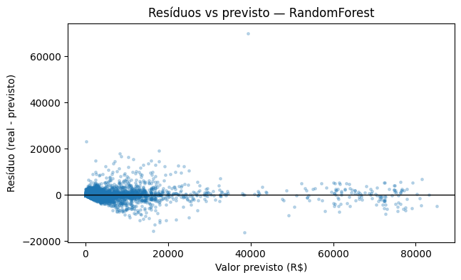
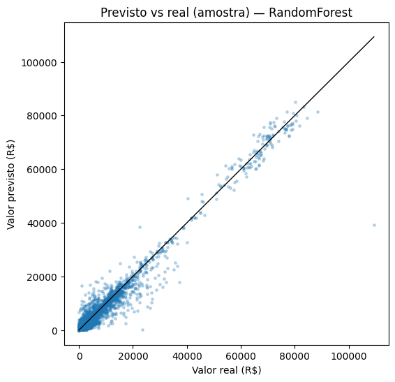

# Projeto final — Introdução ao Machine Learning

**Disciplina:** Introdução ao Machine Learning  
**Curso:** Mestrado em Administração Pública  
**Área de concentração:** Ciência de Dados e Inteligência Artificial  
**Docente responsável:** Roberta Moreira Wichmann  
**Ano e bimestre de referência:** 2026/1  

**Título do projeto:** Previsão de despesas em diárias e passagens com dados do SCDP  

**Autores:** Renê Estevam; Rodrigo Costa; Liandro Silva  

---

## 1. Introdução

Este documento resume a modelagem supervisionada feita no notebook *rene_estevam_deckers_atividade_2.ipynb*, em continuidade da análise exploratória da Atividade 1 (*rene_estevam_deckers.ipynb*). Os dados são do conjunto **Viagens a Serviço do Governo Federal (SCDP)**, disponível em [dados.gov.br](https://dados.gov.br/dados/conjuntos-dados/viagens-a-servico-do-governo-federal-scdp), no mesmo tipo de ficheiro CSV já usado na primeira entrega (por exemplo `base_rene_estevam_deckers.csv`).

Cada linha descreve um trecho de viagem ou um lançamento: órgão, unidade gestora, datas, motivo, valores de diárias e passagem, meio de transporte, entre outros; uma mesma viagem pode gerar várias linhas. O interesse aqui é transparência e leitura de padrões de gasto, não substituir normas orçamentárias.

Quisemos estimar o **valor total da despesa** (em R$) a partir das demais informações do registro — problema de **regressão**, porque o alvo é contínuo. No código o alvo numérico chama-se `valor_total_num`; o dicionário de variáveis da Atividade 1 está em `dicionario_rene_estevam_deckers.xlsx` (23 variáveis).

Evitou-se *data leakage*: não entram como preditoras colunas que reproduzem o total por construção (parcelas monetárias na mesma linha) nem o próprio alvo em `X`.

---

## 2. Metodologia

O que segue espelha o notebook entregue, na ordem em que as células foram construídas.

### 2.1. Análise descritiva preliminar

Na Atividade 1, depois de tirar duplicatas e converter valores e *Número diárias* para número, ficou uma base com **mais de dois milhões** de linhas (da ordem de 2,2 milhões no CSV que usamos). O **Valor total** puxa para a direita (média acima da mediana, cauda longa), o que exige cuidado com *outliers*. O **Valor passagem** mistura muitos zeros, valores positivos e raros negativos (ajustes). Município/UF e categoria de passagem têm bastante falta; *Cargo*, *Motivo* e *Meio de transporte* precisaram de imputação e codificação na fase seguinte.

Na correlação linear com o alvo, sobressaem duração da viagem em dias, número de diárias e valor de diárias; na pré-análise, número e valor de diárias correlacionam forte entre si — problema para regressão linear sem regularização ou escolha de variáveis. Os gráficos da primeira entrega (mediana do total por motivo, série mensal agregada, etc.) continuam só no notebook da Atividade 1.

### 2.2. Divisão entre treino e teste

Partiu-se 80% / 20% (`test_size=0.2`, `random_state=42`). Como o alvo é contínuo e enviesado, usou-se estratificação por **decis** com `pd.qcut` (e `duplicates="drop"` quando há empates nos quantis), para treino e teste terem proporções parecidas de valores baixos, médios e altos. O teste não entra no `fit` do pré-processamento nem no treino. Linhas sem `valor_total_num` saem antes do *split*. Em `X` ficam todas as colunas úteis exceto o alvo numérico e o texto **Valor total**, se existir.

### 2.3. Pré-processamento e transformações

Tudo corre dentro de um **Pipeline** scikit-learn (`ColumnTransformer` + modelo), com `fit` só no treino.

- Criou-se `duracao_dias` entre data de fim e de início (negativos cortados a zero) e retiraram-se as colunas de data em bruto e textos de início/fim de trecho que só repetiam a mesma informação.
- Tiraram-se **Valor diárias** e **Valor passagem** das preditoras (são parcelas do total na linha) e **Nome servidor** (identificação individual, pouco útil para um modelo agregado de custo).
- Mantém-se **Número diárias**; o valor monetário das diárias não entra, o que também corta o par mais colinear com o número de diárias.
- Imputação: mediana nas numéricas, valor mais frequente nas categóricas (`SimpleImputer`), sempre estimada no treino.
- Categóricas: `OneHotEncoder` com até 25 categorias por coluna (`max_categories`), `handle_unknown='ignore'`, saída esparsa quando faz sentido.
- Numéricas: `StandardScaler` após imputação (ajuda Ridge e comparáveis).

### 2.4. Construção e escolha do modelo

Três regressores no mesmo *pipeline* de pré-processamento (`clone` do transformador): **Ridge**, **HistGradientBoostingRegressor** e **RandomForestRegressor**. No treino, `cross_validate` devolveu RMSE, MAE e R² por *fold*. Por RAM, parte da CV e a RF usaram subamostras (`AMOSTRA_CV`, `AMOSTRA_RF`); o *hold-out* da secção anterior não foi usado aqui.

Na corrida que documentamos no notebook, a **Random Forest** teve o menor RMSE médio na CV entre os três, à frente do boosting histórico e do Ridge — o que é plausível quando há muitas dummies e relações não lineares.

### 2.5. Métricas utilizadas

Regressão: **RMSE**, **MAE** e **R²**, na CV (treino) e no conjunto de teste reservado.

### 2.6. Otimização de hiperparâmetros

`RandomizedSearchCV` sobre subamostra do treino (`AMOSTRA_SEARCH`), `cv=3`, a maximizar MSE negativo (reportamos RMSE). Afinaram-se RF, HGB e Ridge **sem olhar para o teste**. Valores que saíram na nossa máquina, só como referência: RMSE de CV por volta de **1022,5** (RF), **1030,6** (HGB) e **1256,6** (Ridge, com `alpha` por volta de 3). RF e HGB ficaram próximos; o desempate ficou para a avaliação no teste.

### 2.7. Avaliação final do modelo

Com os melhores *pipelines* da busca, avaliou-se **uma vez** o conjunto de teste da secção 2.2, com as mesmas métricas e os gráficos que aparecem na secção 3.

---

## 3. Resultados e discussões

### 3.1. Resultados da descritiva preliminar

Em síntese: cauda longa no Valor total; zeros e cauda no Valor passagem; falhas frequentes em localização e categoria; ligação do alvo a duração e a número de diárias; decisão de não usar o valor monetário das diárias como *feature* por colinearidade e por vazamento em relação ao alvo. Figuras detalhadas da descritiva continuam no notebook da Atividade 1.

### 3.2. Resultados dos modelos testados

Na CV do treino, a Random Forest ficou melhor em RMSE médio que HGB e Ridge; o Ridge ficou claramente atrás, o que combina com muitas variáveis *dummy* e efeitos não lineares. O RMSE médio por *fold* ficou acima do MAE médio nos três, sinal de alguns erros grandes — esperável com cauda no alvo.

Depois da busca aleatória de hiperparâmetros, a RF continuou com o melhor RMSE médio na CV interna; o Ridge não recuperou.

No **teste** (números da execução registada no notebook):

| Modelo                    | RMSE (teste) | MAE (teste) | R² (teste) |
|---------------------------|-------------:|------------:|-----------:|
| **Random Forest**         | ≈ 812,04     | ≈ 302,96    | ≈ 0,9623   |
| Ridge                     | ≈ 1191,81    | ≈ 465,22    | ≈ 0,9188   |
| HistGradientBoosting      | ≈ 1247,47    | ≈ 390,12    | ≈ 0,9110   |

O MAE da RF no teste ficou perto de **R$ 303** por linha em média; o RMSE maior indica que ainda há casos com erro bem grande.

*Figura 1 — Resíduos em função do valor predito (Random Forest, teste).*

*Figura 2 — Valores observados versus preditos (amostra, Random Forest).*

### 3.3. Discussão crítica

No teste, a **Random Forest** ganhou nos três indicadores face ao Ridge e ao HGB. Não é surpresa: *random forests* lidam bem com interações e com variáveis categóricas *one-hot* sem exigir um modelo linear. O HGB tinha RMSE de CV parecido com o da RF, mas no *hold-out* desta execução ficou pior — com busca aleatória e poucos *folds*, pequenas diferenças na CV nem sempre repetem.

Os resíduos alargam quando o valor predito sobe (heterocedasticidade): despesas altas são mais difíceis de acertar. No *scatter* predito *vs* real, o miolo acompanha a diagonal; nos extremos caros o modelo tende a puxar para baixo, típico quando se minimiza erro quadrático.

### 3.4. Limitações

- Várias linhas podem pertencer à mesma viagem; tratar cada linha como independente é uma simplificação.
- CV e busca em subamostra por tempo e memória: outro recorte ou outra semente pode mudar um pouco números e ranking.
- O *split* não é temporal; o modelo descreve o padrão do ficheiro usado, não um “futuro” administrativo rigoroso.
- A RF não traz coeficientes fáceis de ler; para uso institucional sério faria falta importância de variáveis ou SHAP em amostra.

---

## 4. Conclusão

A primeira fase já mostrava o **Valor total** assimétrico e com dependência forte de duração e de número de diárias. O encadeamento em **Pipeline**, com imputação e *one-hot* ajustados só no treino e sem *features* que “copiem” o total, foi condição para não iludir com métricas inflacionadas no teste.

Entre Ridge, HistGradientBoosting e Random Forest, **Random Forest** (com os hiperparâmetros vindos da busca) foi a que melhor se portou no teste desta corrida (RMSE ≈ 812, MAE ≈ 303, R² ≈ 0,96), com erros maiores na cauda de despesas altas.

Para quem quiser continuar o trabalho: testar transformação `log1p` no alvo; *split* por ano ou por mês; algoritmos mais leves em GPU (XGBoost, LightGBM, CatBoost); e explicabilidade (permutação, SHAP) sobre uma amostra.

---

## 5. Referências

BRASIL. **Conjunto de dados: Viagens a serviço do governo federal – SCDP**. Portal Brasileiro de Dados Abertos, 2026. Disponível em: https://dados.gov.br/dados/conjuntos-dados/viagens-a-servico-do-governo-federal-scdp. Acesso em: 16 abr. 2026.

GRUS, J. **Data science do zero: noções fundamentais com Python**. 2. ed. São Paulo: Alta Books, 2021. 416 p. ISBN 978-85-5081-176-5.

HARRISON, M. **Machine learning – guia de referência rápida: trabalhando com dados estruturados em Python**. São Paulo: Novatec, 2019. 272 p. ISBN 978-85-7522-817-3.

HUYEN, C. **Projetando sistemas de machine learning: processo interativo para aplicações prontas para produção**. São Paulo: Alta Books, 2024. 384 p. ISBN 978-85-5081-967-9.

JAMES, G. et al. **An introduction to statistical learning: with applications in R**. 2. ed. New York: Springer, 2021.

PEDREGOSA, F. et al. **Scikit-learn: machine learning in Python**. *Journal of Machine Learning Research*, v. 12, p. 2825–2830, 2011.

The pandas development team. **pandas-dev/pandas: pandas**. Zenodo, 2024. Disponível em: https://doi.org/10.5281/zenodo.3509134. Acesso em: 16 abr. 2026.

The Matplotlib Development Team. **Matplotlib: visualization with Python**. Disponível em: https://matplotlib.org. Acesso em: 16 abr. 2026.

Documentação oficial: **scikit-learn** — User Guide. Disponível em: https://scikit-learn.org/stable/user_guide.html. Acesso em: 16 abr. 2026.
